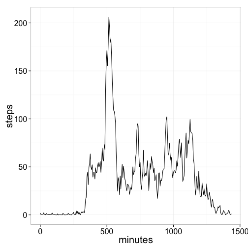
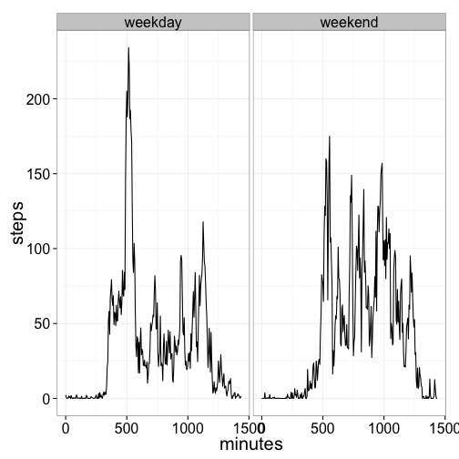

First read the data and do some minimal processing


```r
options(scipen = 2, digits = 2)
require(dplyr,quietly=TRUE,warn.conflicts=FALSE)
activitydata<-tbl_df(read.csv("activity.csv"))
stepsummary<-summarise(group_by(activitydata,date),total=sum(steps),meansteps=mean(steps),median=median(steps))
```

Then show a histogram of it


```r
require(dplyr,quietly=TRUE,warn.conflicts=FALSE)
activitydata<-tbl_df(read.csv("activity.csv"))
stepsummary<-summarise(group_by(activitydata,date),total=sum(steps),meansteps=mean(steps),median=median(steps))
hist(stepsummary$total,breaks=10,main="Number of Steps taken per day",xlab="Total number of Steps",ylab="Number of days")
```

 

Based on this data, the mean number of steps taken per day is 10766 and the median is 10765.

The average daily activity pattern looks like this:


```r
require(lubridate,quietly=TRUE,warn.conflicts=FALSE)
activitydata$time<-hm(formatC(activitydata$interval,width=4,flag=0,big.mark = ":",big.interval = 2))
activitydata$plottableminutes<-(minute(activitydata$time)+60*hour(activitydata$time))
activitydata$time<-NULL
plotme<-summarise(group_by(activitydata,as.numeric(plottableminutes)),mean(steps,na.rm=TRUE))
colnames(plotme)<-c("minutes","steps")
require(ggplot2,quietly=TRUE,warn.conflicts=FALSE)
theme_set(theme_bw(base_size=20))
g<-ggplot(plotme)
g+geom_line(aes(x=minutes,y=steps))
```

 

The peak time for walking is around 17:08.

There are 2304 time periods with missing data.  We impute their values from the non-missing data by using the mean value for that time interval as follows:

```r
imputedactivity<-activitydata
imputedactivity$steps[is.na(imputedactivity$steps)]<-plotme$steps[match(imputedactivity$plottableminutes[is.na(imputedactivity$steps)],plotme$minutes)]
```
This affects the histogram as follows

```r
imputedstepsummary<-summarise(group_by(imputedactivity,date),total=sum(steps),meansteps=mean(steps),median=median(steps))
hist(imputedstepsummary$total,breaks=10,main="Imputed Number of Steps taken per day",xlab="Imputed Total Steps",ylab="Number of days")
```

 

The imputed mean number of steps taken per day is 10766 and the median is 10766.19.
The previous values were mean 10766 and median 10765.
Using imputed values does not affect the mean and moves the median value closer to the mean.

We are curious to see if there are different patterns during the week vs on the weekend. 


```r
activitydata$weekday<-weekdays(ymd(activitydata$date))
activitydata$weekend<-"weekday";activitydata$weekend[activitydata$weekday=="Saturday"|activitydata$weekday=="Sunday"]<-"weekend"
plotme<-summarise(group_by(activitydata,minutes=as.numeric(plottableminutes),weekend=as.factor(weekend)),steps=mean(steps,na.rm=TRUE))
colnames(plotme)<-c("minutes","weekend","steps")
g<-ggplot(plotme)
g+geom_line(aes(x=minutes,y=steps))+facet_wrap( ~ weekend)
```

 
